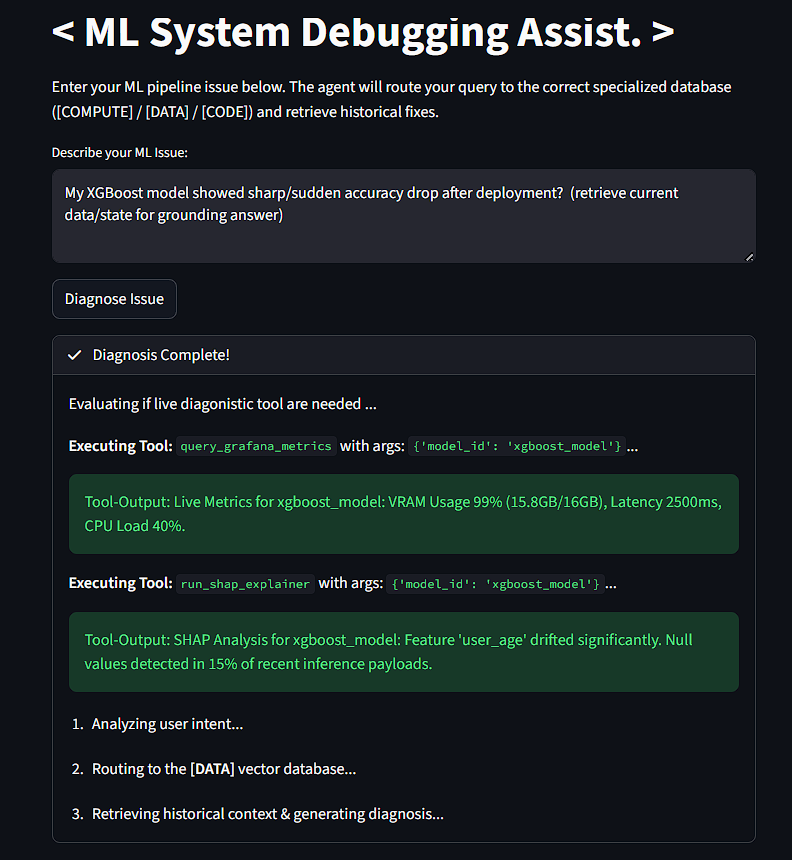
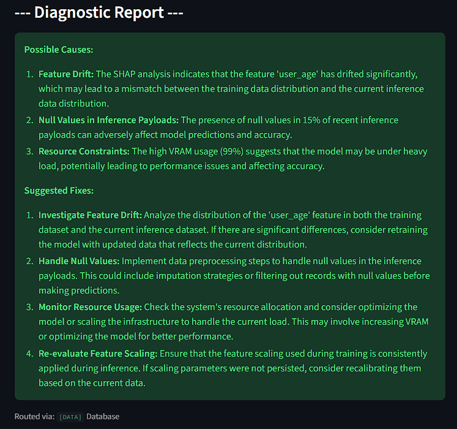

# Parallel: Agentic Semantic Debugging System for Complex ML Pipelines

## Overview

**Parallel** is an agentic AI system designed to automatically diagnose semantic and logical failures in complex machine learning pipelines.

Unlike traditional debugging tools, Parallel runs **after model execution**, analyzes logs and model artifacts, and performs **automated Root Cause Analysis (RCA)** using coordinated AI agents.

The system combines:

• Retrieval-Augmented Generation (RAG)
• Multi-agent reasoning via LangGraph
• Structured tooling for model and data inspection
• Automated failure diagnosis workflows

Parallel acts as an **intelligent debugging layer** for modern ML systems.

--- 

<p align="center">  
 </p> 

---

## Motivation

Debugging production ML systems is difficult because failures are rarely isolated. Issues often arise from interactions between:

• Data distributions
• Feature pipelines
• Model architecture
• Training dynamics
• Deployment environments

Traditional logs provide signals, but not explanations.

Parallel addresses this by:

• Understanding logs semantically
• Inspecting model internals
• Analyzing feature importance
• Detecting distribution shifts
• Performing reasoning across components

The result is **automated, interpretable root cause analysis** rather than manual debugging.

---

## Core Concept

Parallel operates as an **agentic debugging workflow** triggered after model execution.

Instead of reacting to a single query, the system:

1. Collects execution artifacts
2. Routes signals to specialized tools
3. Aggregates structured diagnostics
4. Performs reasoning across results
5. Produces root cause explanations and fixes

This transforms ML debugging from **reactive troubleshooting** into **structured investigation**.

---

## System Architecture

Parallel is built using **LangGraph-based agent orchestration**, enabling modular reasoning workflows.

### High-Level Pipeline

1. Model execution completes
2. Logs and artifacts are collected
3. LangGraph agent workflow begins
4. Router determines relevant diagnostic tools
5. Tools analyze specific components
6. Results are aggregated
7. LLM performs Root Cause Analysis (RCA)
8. Fix recommendations are generated
9. Results are displayed via interactive UI

---

## Agent Workflow (LangGraph)

The system uses multiple specialized tools coordinated through LangGraph.

### Router Agent

Determines which tools to invoke based on observed signals.

Possible routing targets:

• Log Analysis Tool
• Data Distribution Tool
• Feature Importance Tool
• Model Architecture Tool
• Retrieval Tool (historical incidents)

---

### Diagnostic Tools

Each tool focuses on a specific system component.

#### Log Trace Analyzer

Parses structured logs and identifies anomalies such as:

• sudden accuracy drops
• exploding gradients
• training instability
• inference mismatches

Produces semantic summaries of failure patterns.

---

#### SHAP Analyzer

Evaluates model feature usage to detect:

• feature collapse
• unused features
• spurious correlations
• feature drift

Supports explainability-based debugging.

---

#### Model Architecture Inspector

Analyzes model configuration and structure.

Detects:

• incompatible layers
• incorrect dimensions
• activation misuse
• architecture misalignment

Useful for deep learning pipelines.

---

#### Data Distribution Analyzer

Compares training and inference distributions.

Identifies:

• covariate shift
• class imbalance
• distribution drift
• missing value anomalies

Supports robust deployment debugging.

---

#### Historical Incident Retrieval (RAG)

Retrieves similar past failures from a vector database.

Workflow:

1. Incident embeddings stored in FAISS
2. Query embedding generated
3. Similar incidents retrieved
4. Used as contextual memory

Provides **experience-based reasoning**.

---

## Root Cause Analysis (RCA Engine)

All diagnostic outputs are aggregated into a structured reasoning step.

The RCA engine:

• correlates signals across tools
• identifies primary failure causes
• ranks contributing factors
• proposes corrective actions

Output includes:

### Root Causes

Primary issues responsible for failure.

### Contributing Signals

Secondary symptoms supporting the diagnosis.

### Suggested Fixes

Actionable recommendations to resolve issues.

---

## Example Workflow

### Input Signal

```
Model accuracy dropped after deployment
```

### Automated Investigation

Parallel performs:

• Log inspection
• Distribution comparison
• Feature usage analysis
• Historical incident retrieval

### Output

**Root Causes**

• Data distribution shift detected
• Feature normalization mismatch

**Supporting Signals**

• Drift detected in 3 key features
• Inference data mean shifted by +2.3σ

**Suggested Fixes**

• Retrain model using updated dataset
• Align preprocessing pipelines
• Add monitoring alerts for feature drift

---

## Tech Stack

Core technologies powering Parallel:

**Programming**

• Python

**Agent Framework**

• LangGraph
• LangChain

**Vector Database**

• FAISS

**LLM Integration**

• OpenAI API or open-source models

**Frontend**

• Streamlit

**Data Handling**

• NumPy
• Pandas
• PyTorch

---

## Project Structure

```
project/
│── data/
│   └── incidents.json

│── rag/
│   ├── embed.py
│   ├── retrieve.py

│── agent/
│   ├── router.py
│   ├── workflow.py
│   ├── logic.py

│── tools/
│   ├── log_analyzer.py
│   ├── feature_analyzer.py
│   ├── model_inspector.py
│   ├── data_analyzer.py

│── snaps/
│   ├── screen1.png
│   ├── screen2.png

│── app.py              # Streamlit UI
│── main.py             # Pipeline entry
│── README.md
```

---

## Intelligent Routing Layer

Routing logic dynamically determines diagnostic pathways.

Instead of static execution, the system selects tools based on:

• log patterns
• model signals
• data characteristics
• prior failures

This enables **context-aware debugging workflows**.

---

## Live System State Retrieval

Parallel supports simulated or real runtime signal access.

Examples:

• model gradients
• training metrics
• inference logs
• resource usage

This allows deeper system introspection.


## Key Capabilities

### Automated Root Cause Analysis

Eliminates manual investigation loops.

---

### Multi-Tool Reasoning

Combines signals from:

• logs
• data
• model
• architecture

---

### Agentic Debugging Workflows

LangGraph enables:

• dynamic tool orchestration
• structured reasoning chains
• modular extensibility

---

### Experience-Based Diagnosis

Uses historical incident retrieval to improve accuracy.

---

## Future Improvements

Planned extensions include:

• Integration with real monitoring systems
• Advanced reranking for retrieval
• Continuous learning from past failures
• Session-based debugging memory
• Visualization dashboards for RCA graphs
• Automated retraining triggers
• Multi-model system debugging support

---

## Why This Project Matters

Parallel demonstrates the evolution of debugging systems from:

**Logs → Insights → Autonomous Diagnosis**

It showcases:

• Agentic AI system design
• LangGraph orchestration
• Real-world ML debugging workflows
• Retrieval-based reasoning
• Multi-modal diagnostics

This project represents a step toward **self-debugging ML systems**.

---

## Getting Started

### 1. Clone Repository

```
git clone <repo-url>
cd project
```

---

### 2. Install Dependencies

```
pip install -r requirements.txt
```

---


### 3. Run Parallel

```
py runner.py
```

---

## Design Philosophy

Parallel is built around three principles:

**Autonomy**
Systems should debug themselves.

**Explainability**
Root causes must be interpretable.

**Modularity**
New tools should be easy to integrate.
